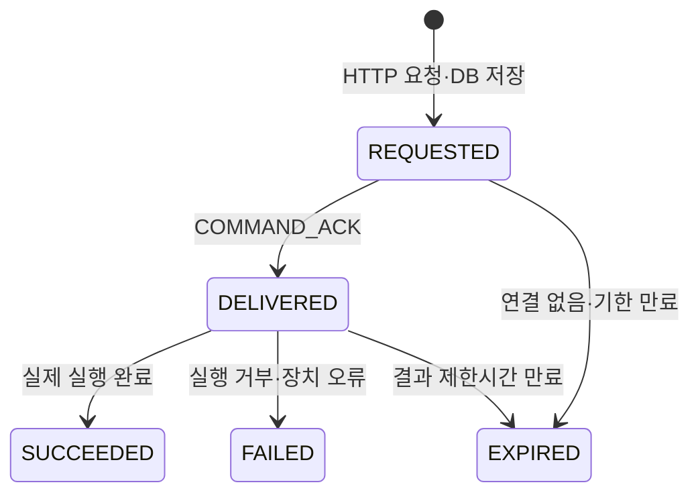

# 백엔드–하드웨어 WebSocket 명세

> 상태: v2 통합 초안 · 실제 하드웨어 지원 기능 확인 후 확정

프론트의 HTTP 요청을 백엔드가 로봇에 전달하고, 로봇의 수신 확인·실행 결과·현재 상태를 백엔드가
DB에 저장하기 위한 계약이다. WebSocket은 아직 구현되지 않았으며 이 문서는 양쪽 구현 기준이다.

## 1. 연결

| 항목 | 초안 |
| --- | --- |
| 주소 | `ws://{backend-host}:8080/ws/devices`·운영 환경은 `wss` |
| 연결 주체 | 하드웨어 프로그램이 백엔드에 연결하고 재연결 |
| 식별 | 등록된 `deviceId` |
| 인증 | 기기별 키 필요. 전달 헤더·발급 방식은 구현 전에 확정 |
| 시각 | UTC ISO 8601, 예: `2026-09-19T09:00:00Z` |
| 문자 인코딩 | UTF-8 JSON |
| 이미지 | WebSocket JSON에 포함하지 않음. 현재는 DB 예제 사용, 이후 HTTP 업로드 계약 확정 |

백엔드는 같은 `deviceId`의 활성 연결을 하나만 인정한다. 연결이 끊기면 하드웨어가 지수 백오프로
재연결하고, 백엔드는 연결 여부와 마지막 보고 시각을 구분해서 관리한다.

## 2. 공통 메시지 형식

```json
{
  "type": "COMMAND",
  "messageId": "8dc780e3-50ee-4c53-82eb-87f5b49edbd2",
  "deviceId": "robot-001",
  "sentAt": "2026-09-19T09:00:00Z",
  "payload": {}
}
```

| 필드 | 규칙 |
| --- | --- |
| `type` | 아래 정의된 메시지 종류 |
| `messageId` | 메시지 UUID. 재전송은 같은 값 사용 |
| `deviceId` | 연결에 사용한 등록 기기 ID와 일치 |
| `sentAt` | 송신자가 메시지를 만든 시각 |
| `payload` | 종류별 데이터 |

알 수 없는 타입·필수 필드 누락·연결 기기와 다른 `deviceId`는 실행하지 않고 오류 응답을 보낸다.

## 3. 백엔드에서 하드웨어로 보내는 명령

```json
{
  "type": "COMMAND",
  "messageId": "8dc780e3-50ee-4c53-82eb-87f5b49edbd2",
  "deviceId": "robot-001",
  "sentAt": "2026-09-19T09:00:00Z",
  "payload": {
    "commandId": "550e8400-e29b-41d4-a716-446655440000",
    "command": "PAUSE",
    "expiresAt": "2026-09-19T09:00:10Z",
    "parameters": {}
  }
}
```

| 명령 | 의미 | 현재 결정 상태 |
| --- | --- | --- |
| `PAUSE` | 현재 작업을 안전하게 일시정지 | 하드웨어 확인 필요 |
| `RESUME` | 안전 확인 후 작업 재개 | 하드웨어 확인 필요 |
| `STOP` | 즉시 또는 완전 정지 | `PAUSE`와 차이를 하드웨어와 확정하기 전 전송 금지 |
| `RECHECK_HAZARD` | 지정 위험물이 남아 있는지 모델 재검사 | 하드웨어·모델 확인 필요 |
| `RELOCATE` | 지정 물체를 안전 위치로 이송 | 위치·가능 물체·완료 기준 확정 전 전송 금지 |

`commandId`는 프론트 HTTP 요청을 받은 백엔드가 생성한다. 같은 명령을 재전송할 때 새 ID를 만들지 않는다.
하드웨어는 이미 최종 처리한 ID를 다시 받으면 동작을 반복하지 않고 이전 결과를 회신한다. 만료된 명령은
실행하지 않고 `EXPIRED` 결과를 보낸다.

## 4. 하드웨어에서 백엔드로 보내는 메시지

명령 수신 확인:

```json
{
  "type": "COMMAND_ACK",
  "messageId": "a96cfcab-29ca-4e52-aa42-14e469a2b81d",
  "deviceId": "robot-001",
  "sentAt": "2026-09-19T09:00:00.300Z",
  "payload": {
    "commandId": "550e8400-e29b-41d4-a716-446655440000",
    "status": "DELIVERED"
  }
}
```

실행 결과:

```json
{
  "type": "COMMAND_RESULT",
  "messageId": "65156832-915d-45b5-bb0b-8fa0e637b16a",
  "deviceId": "robot-001",
  "sentAt": "2026-09-19T09:00:01Z",
  "payload": {
    "commandId": "550e8400-e29b-41d4-a716-446655440000",
    "status": "SUCCEEDED",
    "operationState": "PAUSED",
    "errorCode": null,
    "errorMessage": null,
    "completedAt": "2026-09-19T09:00:01Z"
  }
}
```

최신 상태:

```json
{
  "type": "ROBOT_STATE",
  "messageId": "9b780b32-d982-4146-86a6-8f3cfef3d176",
  "deviceId": "robot-001",
  "sentAt": "2026-09-19T09:00:02Z",
  "payload": {
    "operationState": "RUNNING",
    "movementState": "FORWARD",
    "movementDurationMs": 1200,
    "movementDistanceM": 0.35,
    "batteryPercent": null,
    "sampledAt": "2026-09-19T09:00:02Z"
  }
}
```

| 메시지 | 필수 데이터 | 저장·화면 반영 |
| --- | --- | --- |
| `COMMAND_ACK` | 명령 ID, `DELIVERED` 또는 `REJECTED` | 명령 전달 상태 갱신 |
| `COMMAND_RESULT` | 명령 ID, `SUCCEEDED`·`FAILED`·`EXPIRED`, 완료 시각 | 명령 결과와 실제 운행 상태 갱신 |
| `ROBOT_STATE` | 동작·이동 상태, 측정 시각 | 최신 상태 저장, 프론트 조회에 반영 |
| `DETECTION` | 이벤트 ID, 모델, 라벨, 감지 시각, 이미지 업로드 참조 | 원본 탐지 저장 후 위험 변환 규칙 적용 |
| `HEARTBEAT` | 기기 시각, 선택적 버전 정보 | 연결 생존과 마지막 보고 시각 갱신 |

## 5. 명령 상태 흐름



`REQUESTED`와 `DELIVERED`는 성공이 아니다. 프론트는 `SUCCEEDED`와 실제 상태 보고를 확인한 뒤 성공을
표시한다. 연결이 끊기거나 결과를 잃으면 임의로 성공·실패를 추정하지 않고 미확정 상태를 반환한다.

## 6. 구현 전에 확정할 항목

- 하드웨어가 지원하는 명령과 `PAUSE`·`STOP` 차이
- 기기 인증키 발급·교체 방식
- ACK 제한시간, 실행 제한시간, 재전송 횟수
- 배터리·속도·좌표의 실제 측정 가능 여부와 단위
- 위험 재검사의 대상 지정 방법과 결과 형식
- 안전 위치의 좌표계, 이동 가능 물체, 완료 판단 기준
- 탐지 이미지 HTTP 업로드 경로와 최대 크기
