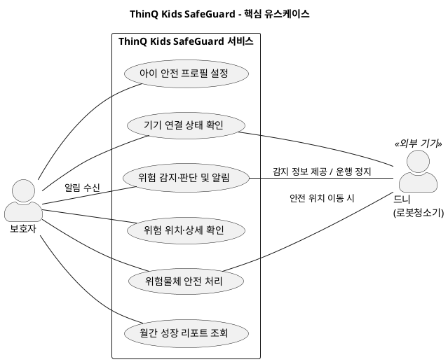

# ThinQ Kids SafeGuard 유스케이스 다이어그램

## 1. 목적과 시스템 범위

**보호자와 드니가 서비스의 핵심 기능에 어떻게 참여하는지**를 보여준다. 현재 PRD·MVP 범위인 TKS_001~TKS_008을 사용자 목적에 따라 **6개 주요 유스케이스**로 묶었다.

- **시스템 경계:** ThinQ Kids SafeGuard 서비스. 앱과 서비스 내부의 정보 저장·프로필 적용·위험 판단·알림 처리를 포함한다.
- **경계 외부:** 서비스를 이용하는 보호자와 데이터를 제공하고 물체를 이동하는 드니 기기.
- **근거:** [CX 기획서](0916%20BX_CX.pdf) p.31~33, [PRD·MVP](PRD_MVP_ThinQ_Kids_SafeGuard.md), [Front 명세서](유스케이스%20명세서%20Front.py) TKS_001~007 및 추가 첨부 TKS_008.

시스템 경계는 앱·서비스와 물리적 기기의 상호작용을 구분하기 위한 다이어그램 표현 기준이다. 원문에 없는 외부 연동 구조를 추가한 것은 아니다.

## 2. 액터 구분

| 액터 | 구분 | 서비스와의 관계 |
| --- | --- | --- |
| **보호자** | 사용자 액터 | 아이의 안전 프로필을 설정하고 기기 상태·위험 정보를 확인하며 안전 처리를 선택한다. 위험 알림을 받는다. |
| **드니(로봇청소기)** | 외부 기기 액터 | 연결 상태 확인에 참여하고 감지 정보를 서비스에 제공한다. 위험 판단 시 운행을 중단하고, 안전 위치 이동 선택 시 물체를 이동한다. |

**별도 액터로 추가하지 않는 대상**

- **아이:** 보호 대상이며, 원문에 직접 서비스를 조작하는 역할은 없다.
- **시스템·AI 판단 기능:** 이번 시스템 경계 안에서 수행하는 기능이므로 외부 액터로 표시하지 않는다.
- **CX 보고서의 Actor 1·2·3:** 고객의 관심·행동을 나눈 유형이다. 현재 서비스에서 서로 다른 권한이나 상호작용 역할이 명시되지 않아 ‘보호자’로 통합한다.
- **외부 API·푸시 제공 시스템:** 원문에 구체적인 외부 API 또는 공급자가 명시되지 않았다. 푸시 기능이 있다는 이유로 별도 외부 시스템을 가정하지 않는다. ThinQ도 별도 외부 연동 시스템으로 정의되어 있지 않아 액터를 추가하지 않는다.

## 3. 액터별 주요 유스케이스

| 주요 유스케이스 | 보호자의 참여 | 드니의 참여 | 원문 대응 |
| --- | --- | --- | --- |
| **아이 안전 프로필 설정** | 아이를 등록하고 적용된 성장단계·기준을 확인 | — | TKS_002~003 |
| **기기 연결 상태 확인** | 온라인·오프라인 상태 확인 | 서비스의 연결 상태 확인에 참여 | TKS_001 |
| **위험 감지·판단 및 알림** | 기준에 해당하는 위험 알림 수신 | 감지 정보 제공 및 위험 판단 시 운행 정지 | TKS_004~005 |
| **위험 위치·상세 확인** | 맵에서 위치와 위험 정보를 확인 | — | TKS_006 |
| **위험물체 안전 처리** | 직접 제거 또는 안전 위치 이동을 선택하고 직접 제거 완료 확인 | 안전 위치 이동을 선택한 경우 물체 이동 | TKS_007 |
| **월간 성장 리포트 조회** | 월별 성장단계 변화·감지 통계·안전조치 변경·다음 단계 예고 확인 | — | TKS_008 |

‘위험 감지·판단 및 알림’에서 **감지는 드니**, **판단·알림은 서비스**가 수행한다. 보호자와의 연결은 알림 수신 참여를 뜻하며, 보호자가 감지를 직접 실행한다는 의미가 아니다.

‘위험물체 안전 처리’는 **직접 제거와 안전 위치 이동의 두 경로**를 포함한다. 드니는 이동 경로에 참여하며 모든 처리에 필수로 참여하는 것은 아니다. 결과는 각각 `처리 완료`, `임시 안전조치 완료`로 구분된다.

## 4. 다이어그램 단순화 기준

- 이름·생년월일 입력, 월령 계산, 저장, 버튼 선택은 상위 유스케이스의 내부 동작으로 묶는다.
- 맵·이미지·위험 사유 조회는 ‘위험 위치·상세 확인’으로 묶는다.
- 처리 결과 저장과 청소 재개 가능 상태는 ‘위험물체 안전 처리’의 결과로 다룬다.
- 오프라인·배터리 부족·이동 실패에 따른 안내는 대안 흐름이므로 별도 타원으로 만들지 않는다.
- 가족 공유·수면 기반 청소·활동 반경별 구역 조정·타 가전 연동은 현재 MVP 범위 밖이므로 생략한다.
- 연결선은 **액터의 참여 관계**를 나타낸다. 처리 순서를 표시하거나 원문의 선행조건을 그대로 `include`·`extend`로 변환하지 않는다.

## 5. PlantUML 코드

